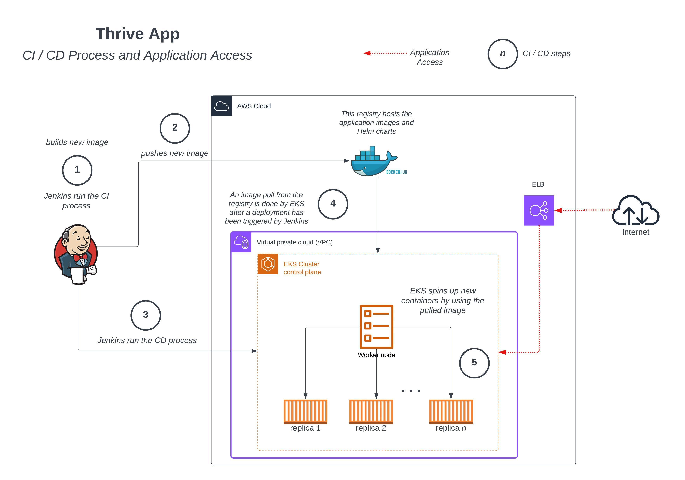
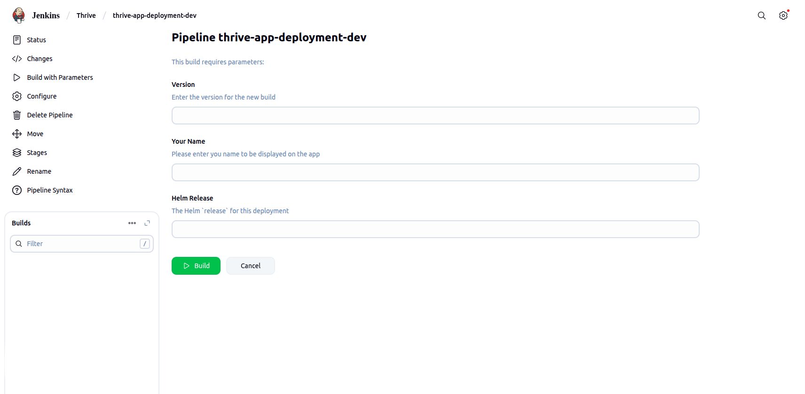
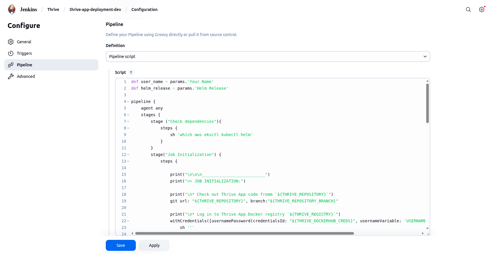
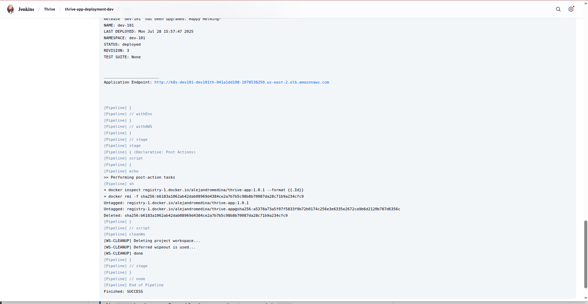

# DevOps/ML Technical Take Home for Thrive

Welcome to this mini project for Thrive!

- [Purpose](#purpose)
- [Platforms and Tooling Used](#platforms-and-tooling-used)
- [Directory Structure](#directory-structure)
- [Infrastructure Components](#infrastructure-components)
- [Application Components](#Application-components)
- [Aplication Architecture](#application-architecture)
- [How to Provision the Thrive App?](#how-to-provision-the-thrive-app)
- [CI/CD Pipeline](#cicd-pipeline)
- [Application Endpoint](#application-endpoint)

<br />

## Purpose
As the next step in Thrive's hiring process, Thrive would like the job applicant to complete a short technical test. This assessment is designed to give them insight into the job applicant technical capabilities, problem-solving approach, and how you work through real-world challenges.

Here you'll read the solution to this assesment, and how I approached it.

<br />

## Platforms and Tooling Used
In order to complete this assesment, I used the following platforms and tools:

- _Amazon Web Services (AWS)_ - The cloud platform selected for the assessment. All of the resources runs there:
    - Kubernetes (EKS)
    - Virtual machines (EC2)
    - Network (VPC)
    - Monitoring (Cloudwatch)
- _Jenkins_ - The CI/CD tool where the pipeline was built on. It builds Docker images and deploys them via Helm. 
- _Helm_ - The package manager for Kubernetes that packages the Thrive app.
- _DockerHub_ - Docker registry that hosts both the Docker images and Helm Charts.
- _Terraform_ - This is the Infrastructure-as-code tool that provisions all the infrastructure on AWS required to run the Thrive app.
- _Github_ - The git repository that hosts all the code of the Thrive app (Terraform, Jenkins, Nodejs, Dockerfile)

<br />

## Directory Structure

This app has the following directory structure:

```
(root)
+-- app/                                 # Directory where the Nodejs files resides in
|   +-- app.js                           # Simple web app written in Nodejs
|
+-- docker/                              # Directory where Docker files reside in
|   +-- Dockerfile                       # Dockerfile that contains the specs to build the Nodejs app 
|
+-- jenkins/                             # Directory where Jenkins files reside in
|   +-- Jenkinsfile                      # Jenkins Pipeline file that builds and deploy the Thrive app
|   +-- job.properties                   # Jenkins job properties (variables)
|
+-- terraform/                           # Directory where Terraform files are in
|   +-- main.tf                          # Terraform main wrapper  
|   +-- variables.tf                     # Terraform main wrapper's variables file that set the default values for the modules
|   +-- output.tf                        # Terraform main wrapper's output file
|   +-- versions.tf                      # Terraform file that sets the minimum versions of the Terraform components
|   +-- providers.tf                     # Terraform provider file
|   +-- terraform.tfvars                 # 
|   +-- modules/                         # Terraform modules
|       +-- aws-vpc/                     # Terraform module that manages VPC resources
|       +-- aws-eks/                     # Terraform module that manages EKS resources
|       +-- aws-eks-lb-controller/       # Terraform module that manages EKS Load Balancer Controllers
|
+-- kubernetes/                          # Directory where Kubernestes files are in
|   +-- helm/                            # Directory for Helm-related files  
|       +-- charts/                      # Directory where Helm charts reside in
|           +-- thrive-helm/             # Directory for the `Thrive app` chart
|               +-- Chart.yaml           # Chart definition file
|               +-- values.yaml          # Default values for the deployment, ingress, and services Kubernetes components
|               +-- templates/           # Chart's templates directory
|                   +-- deployment.yaml  # Kubernetes `deployment` file for the Thrive app
|                   +-- ingress.yaml     # Kubernetes `ingress` file for the Thrive app
|                   +-- service.yaml     # Kubernetes `service` file for the Thrive app
```

<br />

## Infrastructure Components
The Terraform scripts provisions the following infrastructure on AWS for the _Thrive_ app to run:

* A VPC
       - Three (3) public subnets in different AZs
       - Three (3) private subnets in different AZs
       - An Internet Gateway
       - A NAT Gateway
* An EKS cluster
       - AWS Load Balancing Controller
       - AWS Cloudwatch Observality add-on
* Cloudwatch resources
       - Dashboard for the EKS cluster
       - Alarms

Also, _DockerHub_ is used as a Docker and Helm Chart registry for the _Thrive_ app. Here's the details:
* Docker: `registry-1.docker.io/alejandromedina/thrive-app`
* Helm: `registry-1.docker.io/alejandromedina/thrive-helm`

> [!IMPORTANT]
> The credentials to access these registries will be sent out on a separate link

<br />

## Application Components
The _Thrive_ app is made up of a simple web app written in NodeJS.

The NodeJS web app:
* Listens on port `5050/TCP` by default.
* Expects to get an user name via the `USER_NAME` environment variable.
* Displays the content of the `USER_NAME` environment variable when the web app endpoint is hit:
```
# curl http://<web app endpoint>
Hello <user name>!
```

> [!NOTE]
> This user input is passed in through the Jenkins CI/CD pipeline at build time.

<br />

## Application Architecture
Take a look here at a high-level architecture of the application:

<p align="center">
  <kbd></kbd>
</p>

<br />

## How to Provision the Thrive App?

### 1. AWS
- Create an IAM user and set up an_ access key_ for it. Grant this user permissions to manage:
    - EKS
    - VPC
    - EC2
    - Security groups
    - Elastic Load Balancers
    - Cloudwatch
    - Events
    - SNS

> [!IMPORTANT]
> In order to have access to the EKS cluster for the `kubectl`, `eksctk` and `helm` commands, set the`aws_user` variable to this IAM user name in the `terraform.tfvars` file or override it on the command line.

### 2. Git
Clone this repository on the system intended to run the Terraform scripts (see below).

No credentials needed.

```
# git clone https://github.com/chichimedina/thrive-task.git
```

### 3. Terraform
- Install `terraform` on the system intended to run these Terraform scripts. Click on this [link](https://developer.hashicorp.com/terraform/tutorials/aws-get-started/install-cli) to have a reference on how to get it installed.
- Configure the system where you'll be running Terraform on with the above IAM user's access key. Setting them up as _environment variables_ is the easist and secure enough way.
- The `terraform.tfvars` file has the default values to provision the resources for the _Thrive_ app. Feel free to add or change them with your custom values.
- Run the following command to install the required Terraform providers:
  ```
  # terraform init
  ```
- Run the following command to create a Terraform plan:
  ```
  # terraform plan
  ```
- Run the following command to actually apply changes determined by the Terraform plan above:
  ```
  # terraform apply
  ```

> [!NOTE]
> Since the `terraform.tfvars` file contains all the default values to provision the infrastructure required by the Thrive app, the above command can be run without parameters.
>
> However, if you want or need to override these default values, you can do it by appending this for each parameter/variable:
> 
> ``` -var "parameter=value"

<br />

## CI/CD Pipeline
The pipeline that builds and deploys the _Thrive_ app has been written in Jenkins as a _declarative_ pipeline.

> [!NOTE]
> The _Thrive_ app is a Helm chart, and it gets deployed through Helm.
>
> However, this pipeline does not build the Helm chart for this application.
> 
> A default Helm chart has been uploaded already to the registry.

To create this pipeline job:
1. Make sure these prerrequites are installed on the Jenkins node where this pipeline will run (`master` or a `worker` node):
   - `aws` cli
   - `docker`
   - `kubectl`
   - `eksctl`
   - `helm`
2. Make sure these Jenkins plugins are installed:
   - `AWS Credentials`
   - `Pipeline: AWS Steps`
   - `Docker Pipeline`
3. Make sure these Jenkins Crendential vaults are created:
   - For _DockerHub_:
      - name: `thrive-dockerhub-creds`
      - type: `Username with password`
   - For _AWS_:
      - name: `thrive-aws-creds`
      - type: `AWS Credentials`
4. The pipeline expects three (3) build parameters:
      - `Version` (string): version to set for the a _Thrive_ app release.
      - `Your Name` (string): the _user name_ that will be displayed when the app endpoint is hit.
      - `Helm Release` (string): the Helm release keyword you want to use for an app deployment.

<p align="center">
  <kbd></kbd>
</p>

5. When setting up the job:
      - Click on the `Prepare an environment for the run` checkbox.
      - Copy and paste the content of the `jenkins/job.properties` file in to the `Properties Content` box.
      - Copy and paste the content of the `jenkins/Jenkinsfile` file in to the `Pipeline script` box.

<p align="center">
  <kbd></kbd>
</p>

6. Save the job.

How this pipeline works is:
* An user enter the `Version`, `Your Name` and `Helm Release` job parameters.
* The pipeline will then build the Docker image for the _Thrive_ app based on the `docker/Dockerfile` file.
* The built artifact/image is uploaded to DockerHub.
* The deployment step of the pipeline will run _Helm_ to install a chart located in the Helm registry that references the artifact/image above.
* Helm sets dynamically these chart values:
    * `container.image.tag` to the pipeline `Version` parameter.
    * `env.USER_INPUT` to the pipeline `Your Name` parameter.

<br />

## Application Endpoint
Once the _Thrive_ app has been deployed via Jenkins and Helm, the Jenkins job will display the URL where the app can be accessed from.

This endpoint is the AWS Load balancer public DNS name that can also be found on the AWS Load Balancer resources page.

<p align="center">
  <kbd></kbd>
</p>

> [!NOTE]
> No `https` has been configured for the app, so it gets accessed via `http`

